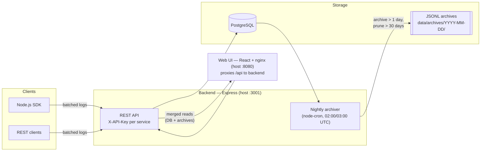

# loggservice

[](https://github.com/sockulags/loggservice/actions/workflows/ci.yml)
[](https://github.com/sockulags/loggservice/actions/workflows/security.yml)

Self-hosted log collection platform: services send logs through a small SDK or plain REST to a central API, which stores them in PostgreSQL, archives them nightly to JSONL files, and serves them to a React dashboard.

> **Note:** this project is pivoting to **clomp** — an open source, tamper-evident audit trail for security work (SOC 2 / NIS2). See [docs/pivot-audit-trail.md](docs/pivot-audit-trail.md).

> Parts of the extended documentation ([SETUP.md](SETUP.md), [QUICKSTART.md](QUICKSTART.md), [ARCHIVE.md](ARCHIVE.md)) are currently in Swedish.

## Architecture



- **Per-service isolation** — every service gets its own API key; a key can only read and write its own logs.
- **Admin API** — creating services and admin operations require a separate `ADMIN_API_KEY` (timing-safe comparison).
- **Hybrid storage** — recent logs live in the database; older logs are archived to JSONL files with 30-day retention. Reads merge both transparently.
- **Hardening** — helmet, CORS whitelist, three-tier rate limiting, non-root containers with healthchecks, CodeQL + Trivy + Dependabot in CI.

## Quick start (Docker)

```bash
git clone https://github.com/sockulags/loggservice.git
cd loggservice

# Configure environment
cp .env.example .env
# Set ADMIN_API_KEY and POSTGRES_PASSWORD in .env to strong random values, e.g.:
openssl rand -hex 32

docker compose up -d
```

- Web UI: http://localhost:8080
- API: http://localhost:3001

## Register a service and send logs

Create a service (requires the admin key):

```bash
curl -X POST http://localhost:3001/api/services \
  -H "X-API-Key: $ADMIN_API_KEY" \
  -H "Content-Type: application/json" \
  -d '{"name": "my-app"}'
# => returns the service API key (shown once)
```

Send a log with the returned service key:

```bash
curl -X POST http://localhost:3001/api/logs \
  -H "X-API-Key: <service-api-key>" \
  -H "Content-Type: application/json" \
  -d '{"level": "info", "message": "Hello from my-app"}'
```

Or use an SDK:

```js
// sdk-nodejs
const LoggplattformSDK = require('./sdk-nodejs')
const log = new LoggplattformSDK({ apiKey: '<service-api-key>', apiUrl: 'http://localhost:3001' })
log.info('Hello from my-app')
```

The [Node.js SDK](sdk-nodejs/) queues logs locally and ships them in batches.

## Development

```bash
# Backend (Express)
cd backend && npm install && npm run dev

# Web UI (React + Vite)
cd web-ui && npm install && npm run dev
```

Tests and linting run in CI (Jest/Vitest with coverage, ESLint), alongside Docker builds, CodeQL and Trivy scans.

## License

See [LICENSE](LICENSE).
